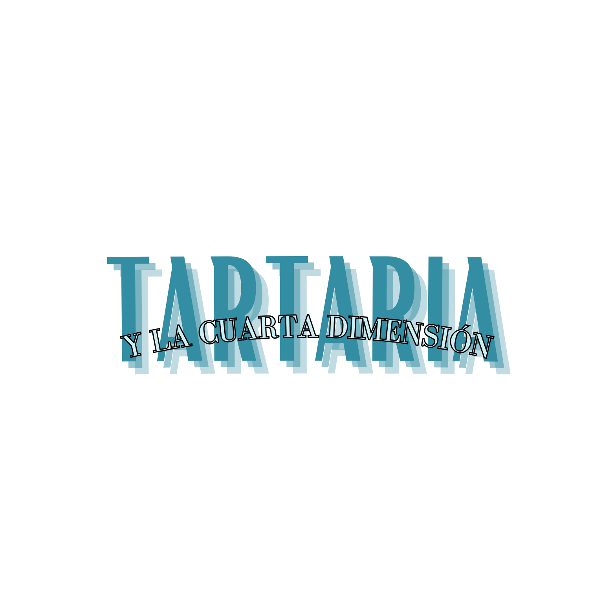

 
# Introducción
En la actualidad, la industria de los videojuegos es una de las mayores formas de entretenimiento a nivel mundial. La tecnología avanza con el paso de los años, lo que provoca que las herramientas para el desarrollo de videojuegos sean más accesibles para todos los públicos.
Tartaria es un juego basado en el género “roguelike”, el cual dentro de los juegos de rol destaca por enfrentar al jugador a niveles con temática de mazmorras, laberintos y una muerte permanente. Todo esto combinado con la estética de los años 80 y 90. Este juego se desarrolla en el motor gráfico de Unity y se lleva a cabo con herramientas como GitHub para la coordinación.
Se consideró hacer este proyecto en el motor de Unreal Engine 5 (UE 5), pero se acabó descartando debido a la complejidad de este, por lo que el otro motor disponible es Unity, el cual es más claro y sencillo en comparación.
Todo el juego está desarrollado en C #, se utiliza una estructura básica del código, pero es necesario aprender los nuevos conceptos que se enfocan específicamente en el desarrollo de videojuegos. Se puede crear y examinar varias funcionalidades para el personaje principal y los NPC, incluidos los enemigos que se encuentran a lo largo del recorrido, y los objetos que nos ayudan a mejorar las estadísticas del jugador, lo cual será de ayuda durante el recorrido. Los enemigos tienen la misión de complicar todo lo posible el camino por los diferentes niveles, algunos se pueden ver venir y se puede estar listo para actuar, pero otros estarán esperando para atacar en el momento menos esperado
Esta idea implica un aprendizaje continuo en todos los aspectos técnicos, los diferentes diseños aplicados en los objetos, mapas, personajes, enemigos, plataformas… La implementación de los niveles, unión y corrección de errores que no se habían experimentado antes. La imaginación y la puesta en escena para el decorado de los sprite que aparecen en el videojuego.
# Enlace
Para consultar información de como escribir un Readme consulte [este enlace](https://docs.github.com/es/get-started/writing-on-github/getting-started-with-writing-and-formatting-on-github/basic-writing-and-formatting-syntax#links)
# Proyecto_Tartaria
>[Nota]
>
>Aqui se desarrollara la descripción del proyecto :+1:

## INDICE.
### 1. Diseño
* Fondos.
* Armas.
* Personajes.
* Enemigos.
* Boss.

### 2. Diseño
### 3. Diseño

Marzo
Recus
#viernes 8 
	- acceso a datos
	- exm Serigio -> empresa
	- Jose Luis -> entrega de practica y examen

#Viernes 15
	- Interfaces -> examen,  entrega modelos de examenes
	- Chema

#Viernes 22
	- Festivo, no se va a la empresa
	- Entrega proyecto sergio practica tocha

Abril
#Vienes 5
	- Excursion

#Viernes 19
	- Entrega parcial del proyecto
